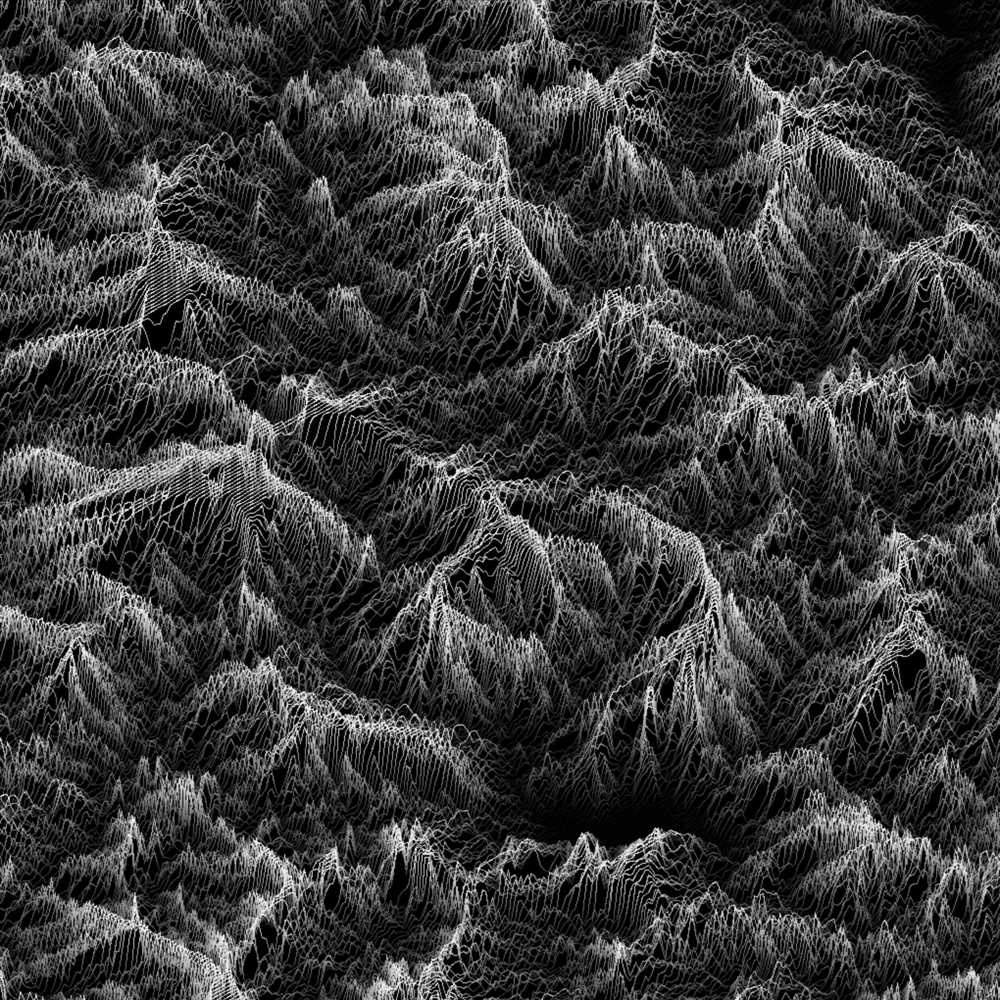
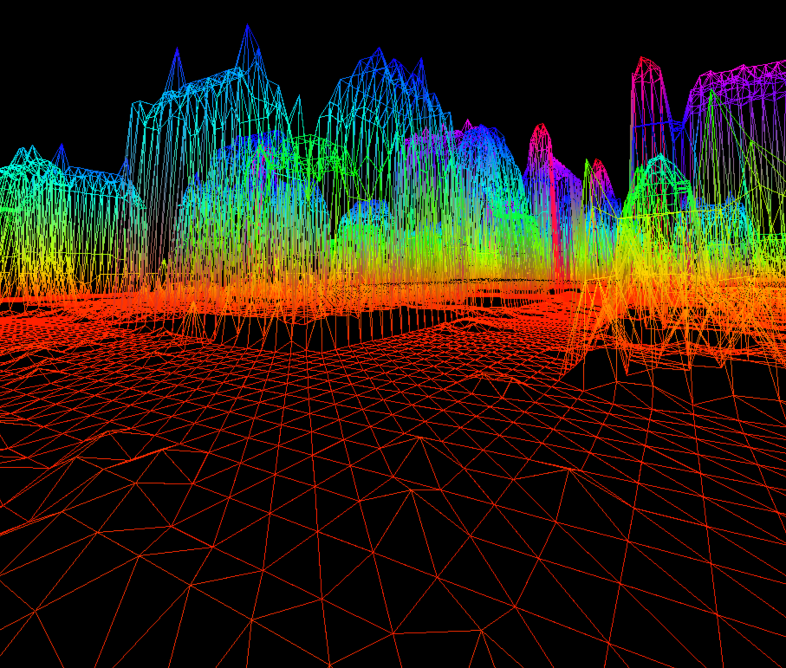
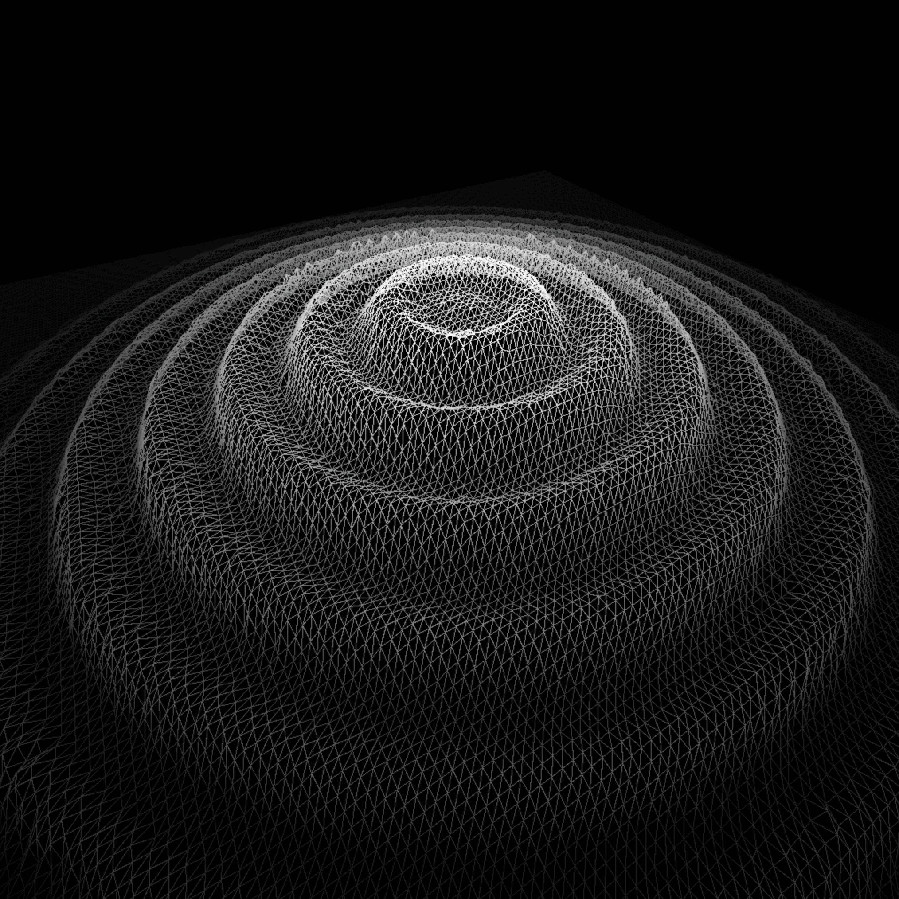

# Fils de Fer

</img>

**Project Goal**

This project is about creating a simplified graphic “wireframe” (“fils de fer” in French,
hence the name of the project) representation of a relief landscape linking various points
(x, y, z) via segments. The coordinates of this landscape are stored in a file passed as
a parameter to your program.

An example of a file containing coordinates may look like the following:
```c
0 0 1 2 3 4 5 6 7 8 9
0 0 0 1 2 3 4 5 6 7 8
0 0 0 0 1 2 3 4 5 6 7
0 0 0 0 0 1 2 3 4 5 6
0 0 0 0 0 0 1 2 3 4 5
0 0 0 0 0 0 0 1 2 3 4
0 0 0 0 0 0 0 0 1 2 3
0 0 0 0 0 0 0 0 0 1 2
0 0 0 0 0 0 0 0 0 0 1
```

**Approach**

Initially, with my previous experience in [Ray Tracing](https://github.com/gmzorz/MiniRT), i figured building a rasterizer would be best way to build this.
The first things that came to mind were the following:

	-	Edge detection
	-	Wireframe shaders

I went to work...
Edge detection is something i implemented in MiniRT for simple scene anti aliasing (now deprecated), but this process uses a kernel convolution (a tad bit slow), and requires an input where every square would be distinguishable by the kernel.
I read a bit about cell shading and remembered this can be done using the object normals, but what happens when all normals are facing the same way?
This method is flawed as the result of a kernel convolution will never be accurate, and the line thickness can vary significantly.
The examples of this project presents an *edge aliased* scene, which edge detection cannot do.
Wireframe shaders are useful as well, but required barycentric coordinates. This was ultimately my final approach until i realized it can be done much more efficiently.

The Bresenham algorithm popped up in my head, a couple years ago i used this line drawing algorithm to make fractal trees, but i recalled the function being quite long. The understanding of the algorithm was already done, so i figured it would be a good idea to completely ignore code readability and compress the function as much as possible to fit the *Norm* of the school (25 lines per function). The [result](https://github.com/gmzorz/Fils-De-Fer/blob/master/src/scene/draw_line.c) is an optimized line-drawing algorithm which you can use as a template to the famous "Where's Waldo" game. Instead of finding waldo you try to find his brain which is scattered all over the place.
But in all seriousness, Imagine Waldo horizontally, then imagine him vertically, maybe even diagonally! Now see how we can draw the lines on his shirt the quickest way.
Oh and also his shirt has different colors, and parts are further away from the camera... I had so much to add.

The projection stage went pretty straightforward, Buffer the vertices and hide those out of the screen, with the exception of me trying to figure out what matrix i had to apply to get the mandatory isometric projection.
Not having paid enough attention to the articles i read and skipping the majority thinking i knew it all, i had simply forgotten that by dividing the coordinates by their respective Z-Coordinate results in a perspective projection. Always read your sources multiple times!

**Project Grade: 125/100**

# Compiling

running `make` will compile on any MacOS system.
Bonus arguments have been ignored as bonuses are integrated in the mandatory part.

# Usage

Run the binary using `./fdf "~/Path/To/File.fdf"` or `./fdf "~/Path/To/image.xpm"`.
FdF supports both .fdf files as well as image (.xpm) files, and will take the length of the normalized pixel channels as height input.

The default projection is set to isometric on startup. Zooming in and out can be done through the `plus (+)` and `minus (-)` keys.
Changing the standard projection will set the viewport to `Perspective` using the `F` key.
This unlocks the `QWEASD` keyboard keys for the ultimate free-roam 3D experience, while mouse movement is handled automatically.

Using the `V` Keyboard key (for.. vertex!) will toggle the amount of lines to display (quads, triangles, horizontal and vertical).
Height color will be dependent on the input file itself, and whether there is color information available. Color stored in a `.fdf` file looks like this:
```c
1 2 3 4 5 6 7 8 9
0 1 2 3,0xFF00FF 4 5 6 7 8
0 0 1 2,0xFF00FF 3 4 5 6 7
0 0 0 1 2 3 4 5 6
```
Where the height value is followed by a hexadecimal value representing the color (`0xRRGGBB`). Colors are interpolated.
This project also offers height representation in Greyscale and HSV mode, and can be triggered using the `C` keyboard key.

# Images

</img>

</img>
